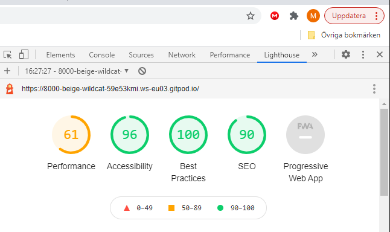

# Witch Ones Pairs?
### ~ A magical memory game for the modern Witch ~

![ Mock up images goes here ]

## Project Goals
**What is it?** 
This is a spiritually themed game that will practice both your memory and your intuition.
Are you feeling strong intuitions today? Have a go and find out!

**Who is it for?**
This game is for anyone that might be into spiritual stuff or might feel that they 
have a witchy vibe.

**Why am I building it?**
I want to create a fun memory game that both encurage the user to practice their memory, 
and gives them small rewards along the way.

## Table of Content

* [**UX**](#ux)
    * [User Goals](#user-goals)
    * [User Stories](#user-stories)
    * [Site Owner Goals](#site-owner-goals)
    * [Design](#design) 
* [**Wireframes**](#wireframes)
* [**Features**](#features)
* [**Technologies Used**](#technologies-used)
    * [Languages](#languages)
    * [Frameworks Libraries Programs](#frameworks-libraries-programs)
* [**Testing**](#testing)
    * [Buggs](#buggs)
* [**Deployment**](#deployment)
    * [GitHub Pages](#gitHub-pages)
* [**Credits**](#credits)

## UX

### User Goals
* The should be responsive so that it looks good and works on well on desktops,
tablets and smartphones
* The user should be able to choose on what kind of level they want to play
Baby Witch (easy), Medium (medium) or ... (hard)
* The user should get positive feedback when cards are matched
* The game should have the estetics that is appeling to the spiritual community

### User Stories

* As a user I want to, know when I have a match
* As a user I want to, know when all cards are matched
* As a user I want to, know how to play 
* As a user I want to, track my score
* As a user I want to, navigate the site with ease

### Site Owner Goals
* To have a site that is attractive to the spiritual community
* For users to have fun while playing

### Design

#### Fonts:

I used fonts from [Google Fonts](https://fonts.google.com/)
* [Italianno](https://fonts.google.com/specimen/Italianno?preview.text_type=custom) is used
for headings, as I wanted something with a light and ancient feel to it 
* [Cormorant](https://fonts.google.com/specimen/Cormorant?preview.text_type=custom) is used
for all other text as I also find this font pretty light but still easy to read

#### Images:

All images are my own and is taken by me using eihter my Sony Xperia or my 
Canon EOS450D. All images are also edited by me.

#### Color: 

I wanted to use colors that match the moon background image.

[Back to top](#table-of-content)

## Wireframes
Balsamiq was used to create the wireframes for this project

* Desktop Wireframes
    * [Index](wireframes/index.png)
    * [Index (match)](wireframes/index-match.png)
    * [Index (all matched)](wireframes/index-all-matched.png)
    * [About](wireframes/about.png)
    * [Score](wireframes/score.png)
* Tablet Wireframes
    * [Index](wireframes/index-tablet.png)
    * [About](wireframes/about-tablet.png)
    * [Score](wireframes/score-tablet.png)

* Smartphone Wireframes 
    * [Index](wireframes/index-sp.png)
    * [About](wireframes/about-sp.png)
    * [Score](wireframes/score-sp.png)

[Back to top](#table-of-content)

## Features
* Responsive on different devices
* A spiritual message for every matched pair of cards
* A congratulations message when all cards are matched

[Back to top](#table-of-content)

## Technologies Used
#### Languages
* [HTML5](https://en.wikipedia.org/wiki/HTML5)
* [CSS3](https://en.wikipedia.org/wiki/CSS)
* [JavaScript](https://en.wikipedia.org/wiki/JavaScript)

#### Frameworks and Libraries 
* [Google Fonts](https://fonts.google.com/) was used to import the fonts mentioned above 
in the project
* [Coolors](https://coolors.co/) was used to decide on th colors and to create the color 
palette
* [Am I Responsive](http://ami.responsivedesign.is/) was use to make the mockup
* [SweetAlert 2](https://sweetalert2.github.io/) was used to make the alert message 

#### Tools
* [Balsamic](https://balsamiq.com) was used to create wireframes in the beginning of 
the project
* [Material.io](https://material.io/) was used to check that the contrast is ok
* [Gimp](https://www.gimp.org/) was used to edit photos.
* [Favicon.cc](https://www.favicon.cc/) was used to create the fave icon
* [Webformatter](https://webformatter.com/html) was used to beautify the code
* [Copressor.io](https://compressor.io/) was used to compress the background image
* [Gitpod](https://gitpod.io/) was used for coding the project
* [Github](https://github.com/) was used to saved and stored on the project after being 
pushed from Gitpod

[Back to top](#table-of-content)

## Testing
* [W3C Markup Validator](https://validator.w3.org/)
* [W3C CSS Validator](https://jigsaw.w3.org/css-validator/)
* [JSHint](https://jshint.com/)

**Lighthouse**

* Test 1

* Test 2

* Test 3 ( test is run after the background image  was changed to a compressed image. )

### User Stories
**As a user I want to, know when I have a match**

* Plan

I want to create a message that will pop up every time the user match a pair of cards.
My first idea was to have a specific message apply when a specific pair of cards are 
matched. But I realized that it would probably be much more fun to get different 
messages every time. And within the spiritual community so called “angel numbers” 
are popular, so I decided to go with that instead

* Implementation

I created an array with eleven different messages. That way the user might get another 
next time they play which will make it more fun. When two cards match after they are 
fliped an alert will pop up for 2500 milliseconds displaying one of the messages in 
the array.

* Test

At first I used a standard alert, but that included an OK button which needs to be 
clicked. And I don’t want the user to have to click a button while playing. So I 
used an alert from SweetAlerts that I customized so that random messages from the 
array messageList will be displayed and so that it didn’t need to be clicked. 

* Result

Randomization of the messages works, and a different message pops up every time the 
user gets a matched pair of cards. The message then disappear by it self after 
2.5 seconds, or when the next time the board is clicked.

* Verdict 

The message works as planned

**As a user I want to, know when all cards are matched**

* Plan

I want the user to know when all the cards are matched and the have won. Following the 
spiritual theme for the game I want the message displayed be inline with the messages 
shown when the user have a match.

* Implementation

I created a div with an overlay class and a winner-text id that will be called inside 
the winner function in the javaScrit document. When the user have matched all cards 
the winner function will be called and a message will overlay the screen congratulating 
the winner and stop the timer.

* Test

Getting the winning screen to display when all the cards are matched was no problem. 
But even though the screen is on top of the board the timer still counts down in the 
background. And when it’s done the Game Over screen was also displayed. To stop this 
from happening I added tStared from the gameTimer function and set it to false to stop 
the timer and prevent the Game Over screen from showing

* Result

The winning screen works as planned and is displayed when the user have matched all 
the cards on the board. The timer is stopped preventing a double overlay of screens.

* Verdict 

The winner screen works as planned.

**As a user I want to, know how to play**

* Plan

I want to give the user a short and simple description of the game, and I want the 
layout to make it easy to figure out how it’s played even if the description isn’t read. 

* Implementation

I created a modal that will be shown when the user clicks on the About button. 
The modal gives the user a short description of the game theme and how to win. To 
create the modal I use code from w3schools and customized it so it goes with the theme 
of the game.

* Test

At first I created a second html page that I linked from the index.html. But after 
talking with my mentor I went for using a modal instead to get a better user experience.

* Result

When the user opens the game they have the choice to click on the About button. 
A modal will show up and tell them about the game

* Verdict 

The about modal works as planned.

**As a user I want to, track my score**

* Plan

To make the game a little bit more exciting I also want the user to have some points 
when they match a pair of cards.

* Implementation

 I created a span that would show the score, and I also created a variable for the 
 score and then added it into the flipCard function. The span is pulled from the html 
 to the js file using getElementById, and when the user matches two cards it gives the 
 score of 10 points and they are shown right above the board.

* Test

By flipping the cards until there’s a match the score function is tested. 
* Result

Each time two cards match the score increases with 10 points. It is displayed right 
above the board so that it’s easy for the user to see while continuing playing. 

* Verdict 

The score points works as planned.

**As a user I want to, navigate the site with ease**

* Plan

I want it to be easy for the user to understand how navigate around the page and to 
provide a layout that isn’t confusing

* Implementation

I created an overlay start screen that invites the user to enter the game by clicking it. 
By clicking the overlay it removes the visible class and the cards are ready to be 
clicked and the game can begin. The user also have the option to learn a little about 
the game by clicking the about button and trigger the about modal.

* Test

The start screen is visible when the user enters the page. When the screen is clicked it 
disappears and the user have a clear view of the board, timer, score and about button. 
If the about button is clicked the about modal with information about the game pops up,
and can easy be closed clicking the X in the corner. This takes the user back to the
board to start the game.

* Result

It’s easy for the user to get a clear overview of the game and to keep track off the 
score and time while playing. It’s also easy to find the about button to learn more 
about the game. And the modal can be close in a simple way.

* Verdict 

It’s easy for the user to navigate the site.

## Bugs

**Timer**
* **Bug**

The countdown timer starts as soon as the user enters the site, and it runs in 
the background behind the overlay-text class and not when the first card is 
clicked.

* **Fix**

I created a function called gameTimer() instead of using inline coding. Then a 
variable for starting the timer called let tStarted was created and set to false 
since I don’t want it to run. Within the gameTimer() function tStarted is set 
to true as I want the timer to be running within the function. Console.log() 
to be able to see that it works. To be able to start the timer when a card is 
flipped I added an if statement in flipCard(), and within that if statement 
set tStarted to true.

* **Verdict**

The timer now runs when the first card is clicked

**Game Over** 

* **Bug**

The Game Over screen doesn't show up when the time is out, and the user 
can continue to flip cards.

* **Fix**

I started with commenting out document.getElementById("time-left") = gameOver(); since 
that line was causing an error. Then I added clearInterval(this.countdown);  to set the
 timer to 0 when the time has run out. I then realized that I needed to change 
("time-left") to ("game-over-text") to call the correct div in the .html. After 
that I added classList.add to target the visible so the Game Over screen pops up when the timer runs out.
The user is still able to click the Game Over screen and continue flipping cards.
To stop the user from doing this the cards need to be locked. So I call the variable 
lockBoard and set it to true within the gameTimer function. When the time runs out the 
board is locked and the user can’t continue to flip cards

* **Verdict**

The Game Over screen is displayed and the cards can’t be clicked when the timer 
reaches 0.

**White space**  
* **Bug** 

A mysterious white space has appeared to the right and bottom after making 
the background image responsive for smartphones and tablet so that the moon 
in the background image is visible on all screens. It only appears in dev 
tools when the site is previewed with the smartphone frame, but not when the 
edge is pulled to make the screen smaller.

* **Fix**

Tried to add a negative margin-right, but that also adds some space when it's 
not previewed with the smartphone frame. Removed background position-x from 
media queries for smartphone. Still got a white space. After talking to my 
mentor *Simen Eventyret_mentor* it was decided that it wasn’t a priority so I also 
removed it from media queries for tablet. The white space is gone!

* **Verdict**

Even if the moon in the background image isn't showing the white space is gone. And 
the part of the image that is showing on a mobile screen is the darker area and that work good
too since it makes the text and the cards stand out more on the small screen which makes the
contrast better.

* **Bug**
* **Fix**
* **Verdict**

[Back to top](#table-of-content)

## Deployment
### GitHub Pages
How to deploy project using Github pages:

1. Go to Github
2. Log in and click on “Repositories” tab in the top middle of the screen
3. Choose this repository
4. Click on the "Settings" tab (with a gear icon)
5. Scroll down on the page until you find the "Github Pages" section
6. Under "Source" you'll find a dropdown which is set to "none"
7. Change it to "Master"
8. Then click the save button. This will reload the page.
9. Scroll back down to "Github Pages"
10. A green alert box will now tell you that your site been published and provide you a link to the site.

How make a local clone:
1. Locate the repository
2. In the reposirory you can either use the green Gitpod or Code/Download button
3. To clone with HTTPS option click the Code/Download button, and copy the link displayed.
4. Open the command line if it's not open.
5. Change the working directory to the location where the cloned directory is to be made.
6. Type "git clone" command and paste the url copied in step 3.
7. Press Enter. The local clone will be created

[Back to top](#table-of-content)

## Credits
### Inspiration
* [freeCodeCamp](https://youtu.be/ZniVgo8U7ek)
* [Code with Ania Kubów](https://www.youtube.com/watch?v=tjyDOHzKN0w)
* [PortEXE  ](https://www.youtube.com/watch?v=3uuQ3g92oPQ&t=2746s)
* [Modal ](https://www.w3schools.com/howto/howto_css_modals.asp)

* Thank you to Ann-Sofie Appelvik in the Holy Crap Community on facebook for helping me to 
come up with a good name for the game/project
* A huge thank you to my mentor Simen Eventyret_mentor for all the good advices, feedback 
and most of all patience.
* Thank you to my older brother David who’s been a wonderful support in me deepest times of 
dispear and helped me with testing and good advices to help me get a better understanding for the code.
You're the best!

[Back to top](#table-of-content)